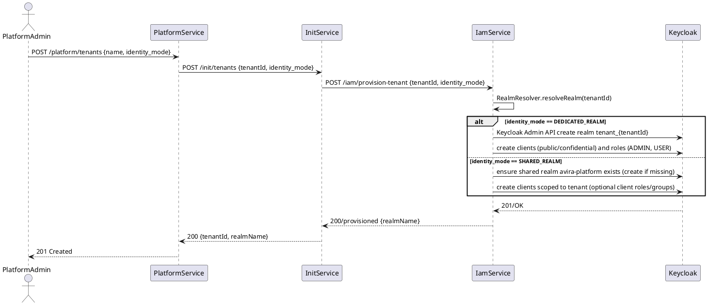
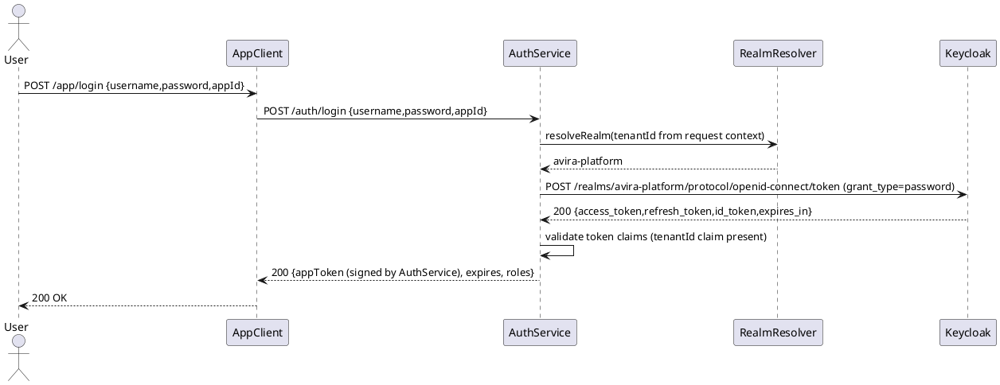
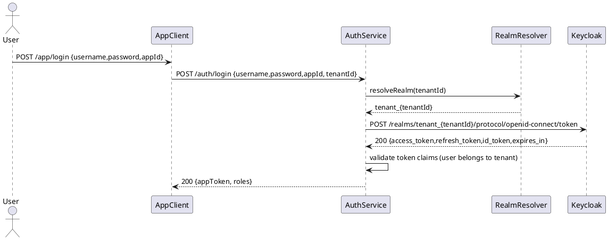

# Keycloak Provisioning & Authentication Integration (Avira)

**Scope Summary**
- **Goal:** Define how Keycloak realms/clients/roles are provisioned and how services integrate for authentication.
- **In scope:** iam-service Keycloak provisioning, init-service bootstrapping (default tenant + shared realm), authentication-service token flows (login/refresh/logout/validation), docker-compose runtime notes.
- **Out of scope:** application-service calling Keycloak Admin API (forbidden), full UI flows.

**Service Boundary Map**
- **iam-service:** Sole owner of Keycloak Admin API interactions and provisioning. Exposes REST/Admin endpoints for platform ops.
- **init-service:** Bootstrapping and environment initialization (create shared realm, default SaaS tenant, initial clients). Can call iam-service APIs or post messages to iam-service.
- **platform-service:** Creates tenant records and requests provisioning via init-service or iam-service orchestration.
- **authentication-service:** Runtime authentication: communicates with Keycloak token endpoints, validates tokens, issues/returns application JWTs. MUST NOT call Keycloak Admin API.

**API / Data Flow Notes (high level)**
- Tenant creation: platform-service -> init-service (sync REST or event) -> iam-service (provision realm/clients/roles) -> DB updates and notification back to platform-service.
- Login: client -> authentication-service -> authentication-service resolves realm via `RealmResolver` -> authentication-service calls Keycloak token endpoint (realm-specific) -> validates tokens and issues app token.

**Sequence Diagrams**

Tenant creation -> init-service -> Keycloak provisioning (PlantUML)



Login flow — Shared realm (PlantUML)



Login flow — Dedicated realm (PlantUML)



**API Contract Drafts**

Init-Service (bootstrap/orchestration)
- POST /init/tenants
  - Request: { "tenantId": "uuid", "name": "string", "identityMode": "SHARED_REALM|DEDICATED_REALM" }
  - Response: 202 Accepted { "tenantId":"uuid", "status":"provisioning" }
  - Notes: async operation acceptable; will call iam-service /provision or post event.
- POST /init/shared-realm
  - Request: { "realmName": "avira-platform" }
  - Response: 200 { "realmName":"avira-platform", "created": true }

Iam-Service (provisioning & Keycloak admin wrapper)
- POST /iam/provision-tenant
  - Request: { "tenantId":"uuid", "identityMode":"SHARED_REALM|DEDICATED_REALM", "adminEmail":"string" }
  - Response: 200 { "tenantId":"uuid", "realmName":"string", "clients":[...], "roles":["ADMIN","USER"] }
- POST /iam/realms
  - Request: { "realmName":"string" }
  - Response: 201 { "realmName":"string" }
- POST /iam/realms/{realm}/clients
  - Request: { "clientId":"string", "type":"public|confidential", "redirectUris":[], "credentials":{...} }
  - Response: 201 { "clientId":"string", "secret": "string?" }
- POST /iam/realms/{realm}/roles
  - Request: { "roleName":"string" }
  - Response: 201 { "roleName":"string" }

DTO examples (JSON schema-like)
- TenantProvisionRequest
  - tenantId: string (uuid)
  - name: string
  - identityMode: string (SHARED_REALM|DEDICATED_REALM)
- ProvisionResponse
  - tenantId: string
  - realmName: string
  - clients: [{clientId, type, secret?}]
  - roles: [string]

**Security and Tenant Isolation Notes**
- Always extract `tenant_id` from a trusted source: platform JWT, gateway header set by Kong, or backend DB joins. Never trust client-provided tenantId.
- Keycloak Admin API credentials MUST be stored in iam-service secret/config and not exposed externally.
- `RealmResolver` interface MUST be used by iam-service and authentication-service to map tenantId -> realmName.
- For SHARED_REALM: tokens issued by `avira-platform` MUST include a `tenant_id` claim. Authentication-service must validate this claim against the requested tenant/app ownership.
- For DEDICATED_REALM: realm name encodes tenant ownership (tenant_{tenantId}) but still validate user membership via Keycloak groups/claims.
- All provisioning endpoints require platform-admin scope; calls must be authenticated with a platform admin token (Keycloak service account or mTLS).

**Concrete Implementation Tasks (Backend Dev)**
- iam-service
  - Add `RealmResolver` interface
    - path: [iam-service/src/main/java/com/avira/iam/init-service/RealmResolver.java](iam-service/src/main/java/com/avira/iam/init-service/RealmResolver.java)
  - Implement `KeycloakProvisionService` (wraps Keycloak Admin API)
    - path: [iam-service/src/main/java/com/avira/iam/init-service/KeycloakProvisionService.java](iam-service/src/main/java/com/avira/iam/init-service/KeycloakProvisionService.java)
  - Controller for provisioning
    - path: [iam-service/src/main/java/com/avira/iam/init-service/ProvisionController.java](iam-service/src/main/java/com/avira/iam/init-service/ProvisionController.java)
  - DTOs and mappers
    - path: [iam-service/src/main/java/com/avira/iam/init-service/dto/*](iam-service/src/main/java/com/avira/iam/init-service/dto/)
  - Config: Keycloak admin client configuration
    - path: [iam-service/src/main/resources/application-init.yml](iam-service/src/main/resources/application-init.yml)

- init-service
  - Startup runner to create `avira-platform` shared realm and default tenant
    - path: [init-service/src/main/java/com/avira/init/StartupProvisioner.java]
  - Controller to accept platform bootstrap requests
    - path: [init-service/src/main/java/com/avira/init/InitController.java]

- authentication-service
  - Add `RealmResolver` consumer to resolve realms
    - path: [authentication-service/src/main/java/com/avira/auth/realm/RealmResolver.java](authentication-service/src/main/java/com/avira/auth/realm/RealmResolver.java)
  - Implement `KeycloakAuthClient` to call token/refresh/logout endpoints
    - path: [authentication-service/src/main/java/com/avira/auth/integration/KeycloakAuthClient.java](authentication-service/src/main/java/com/avira/auth/integration/KeycloakAuthClient.java)
  - `AuthenticationHandler` implementations should use the KeycloakAuthClient for PLATFORM flows
    - path: [authentication-service/src/main/java/com/avira/authentication-service/handlers/*](authentication-service/src/main/java/com/avira/authentication-service/handlers/)
  - Token validation filter/service to validate token signatures and claims
    - path: [authentication-service/src/main/java/com/avira/auth/validation/TokenValidationService.java](authentication-service/src/main/java/com/avira/auth/validation/TokenValidationService.java)

- common-lib
  - Shared DTOs for provision requests and responses
  - path: [common-lib/src/main/java/com/avira/common/dto/Provision*](common-lib/src/main/java/com/avira/common/dto/)
  - Shared `WebClient` config for Keycloak calls

**Docker / Deployment Notes**
- Use docker-compose Keycloak + Postgres for local development (already present). Ensure these env vars are set for Keycloak service in `docker-compose.yml`:
  - `KEYCLOAK_ADMIN=admin` and `KEYCLOAK_ADMIN_PASSWORD=changeme` (use secrets in CI/deploy)
  - `KC_HTTP_RELATIVE_PATH` or `KC_HOSTNAME_STRICT=false` if needed for reverse proxy
- Add healthcheck to Keycloak service and `depends_on` with `condition: service_healthy` for init-service and iam-service in `docker-compose.yml`.
- Provide a wait-for script used by init-service container to poll Keycloak token endpoint until ready: `scripts/wait-for-keycloak.sh` (or .ps1 for Windows). Export env vars: `KEYCLOAK_URL`, `KEYCLOAK_ADMIN_USER`, `KEYCLOAK_ADMIN_PASSWORD`, `SHARED_REALM=avira-platform`.
- Example env required for iam-service/init-service:
```
KEYCLOAK_URL=http://keycloak:8080
KEYCLOAK_ADMIN_USER=admin
KEYCLOAK_ADMIN_PASSWORD=changeme
SHARED_REALM=avira-platform
```

**Deploy Order (Local)**
- Start dependency containers first: postgres -> keycloak.
- Wait until Keycloak admin endpoint is reachable.
- Start iam-service so `InitRunner` can bootstrap shared realm and default tenant realm/clients/roles.
- Start remaining services after iam-service finishes startup provisioning.

**Assumptions & Open Questions**
- Assumption: `docker-compose.yml` already contains a Keycloak and Postgres service for local dev. (If not, we'll add them.)
- Assumption: Platform admin operations are instrumented with a platform-admin JWT or mTLS; IAM endpoints will validate that scope.
- Open question: Who is the canonical caller to provision dedicated realms — `init-service` (on tenant create) or `iam-service` (direct from platform)? Design allows either; recommend `init-service` orchestration calling `iam-service` to keep provisioning logic centralized.
- Open question: Should dedicated-realm creation be manual (approval) for enterprise tenants? Plan allows gating via subscription/pricing.
- Open question: Schema for client credentials rotation and secrets storage (Vault vs DB) — recommend secrets manager for production.

**Artifact Path**
- This document: [.github/skills/a_tool/architect/flow-keycloak-auth.md](.github/skills/a_tool/architect/flow-keycloak-auth.md)

---
End of artifact.
